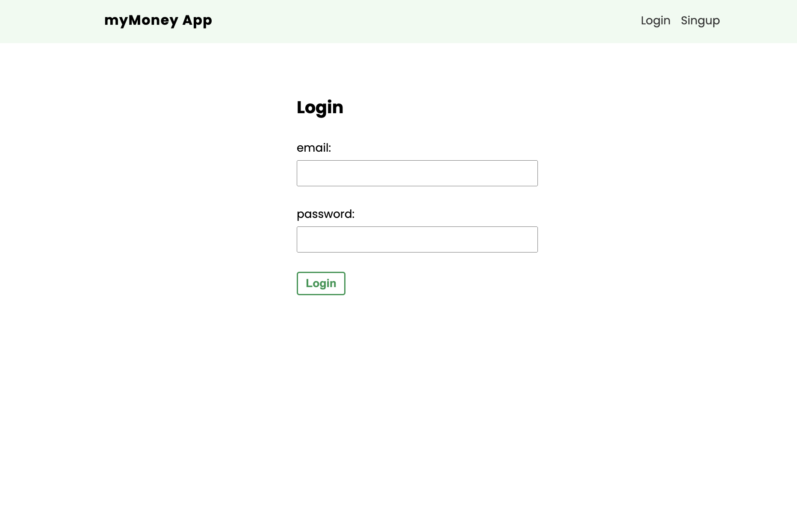
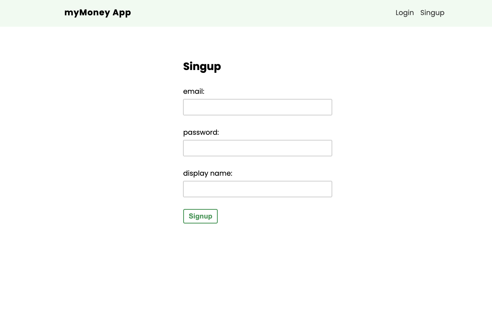
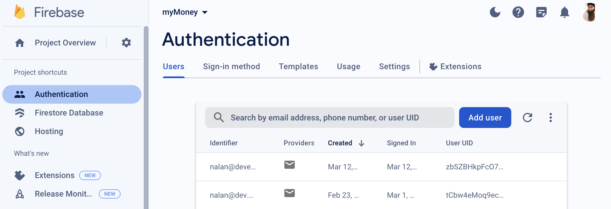
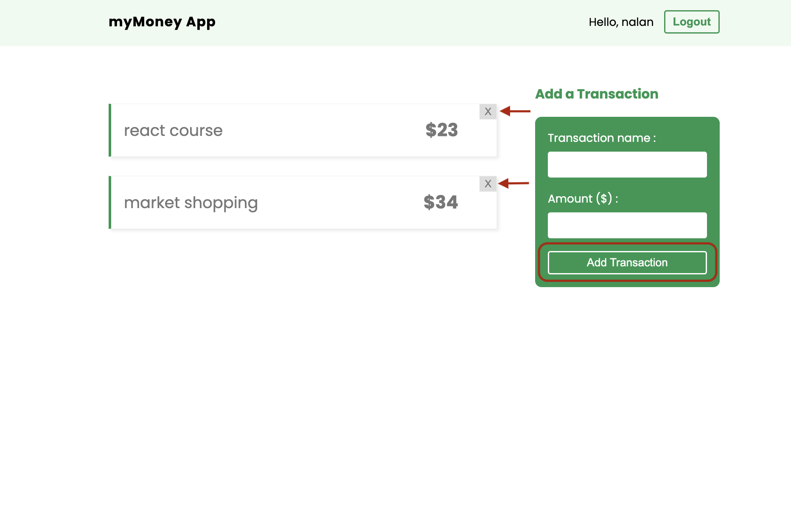
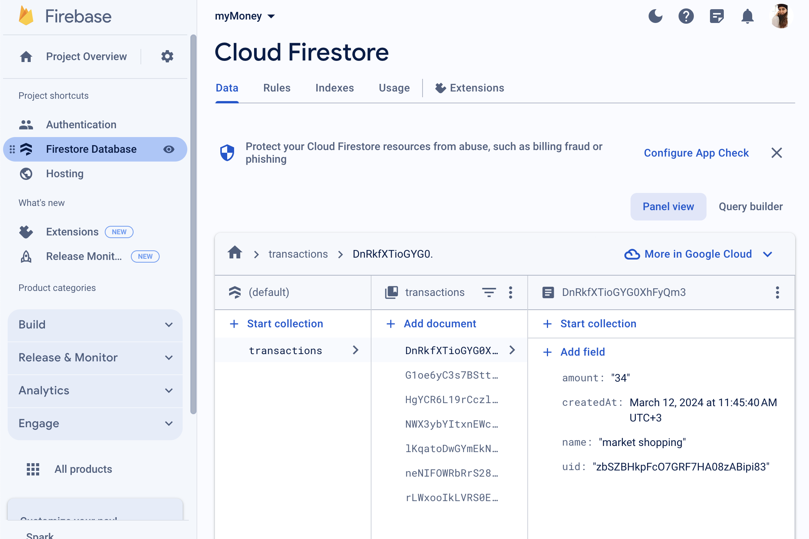

## my-money-app

Basically, Firebase authentication is a project of logging in and out of users to the application, seeing all the transactions made, and adding new ones.

It is also a project that includes applications such as creating custom react hooks to interact with different Firebase services such as the Firestore database.

You will see this screen when you first run the application.

If you have previously created a login registration, you can log in to the application by entering your email and password.

If you do not have a recording, you can create a new recording by clicking the signup button in the upper right corner.

All user operations are handled by the firebase database.

After logging in or signing up, you will be greeted with the screen you see below.

You will see the add a transaction section on the right.
By entering the transaction name and amount information here, you can see all your transactions listed.

You can delete the added transaction when you press the x button at the location indicated by the red arrow.

All transactions made on this page;

- add a new transaction
- deleting the added transaction

It is done with the Firebase database.

